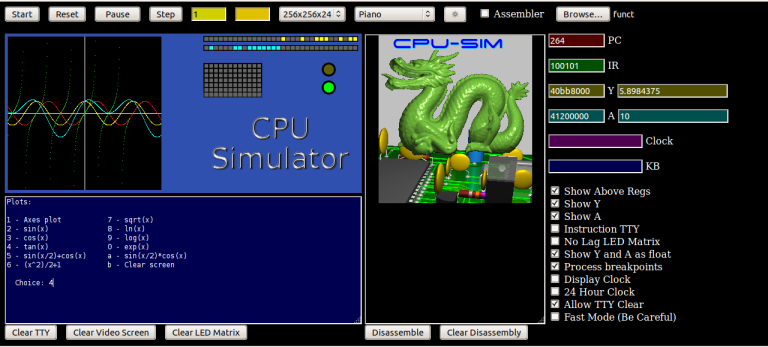
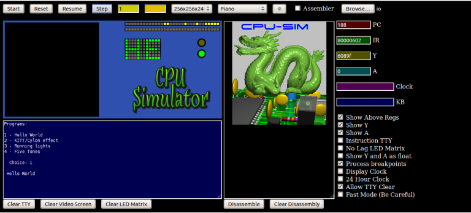
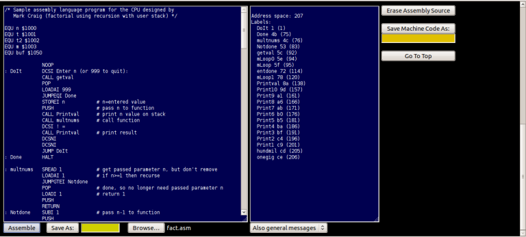
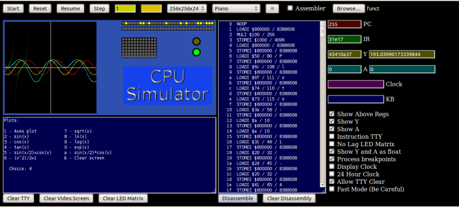
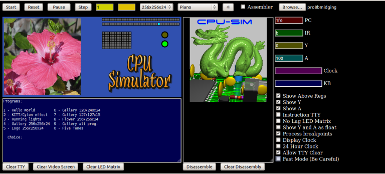

CPU Simulator And Assembler
===========================

This is an HTML/Javascript CPU simulator and assembler for the CPU I designed.
Originally, I created this CPU on paper many years ago for a homework
assignment in college.  More recently, I implemented my design in the
Logisim (and Logisim Evolution) logic simulator, and eventually it ran on an
FPGA.  Refer to the [Video Series](#videoseries) section for links to my
youtube series about this design.

<table border=5><tr><td></td></tr></table>
<table border=5><tr><td></td></tr></table>
<table border=5><tr><td></td></tr></table>
<table border=5><tr><td></td></tr></table>
<table border=5><tr><td></td></tr></table>

(I purposely used an older browser for the screenshots because I prefer the 3d
look over the flat button look of some modern browsers.)

## Setup and Running

>**OPTIONAL:**  If you want a gradual transition between Dark and Light modes,
>uncomment the line containing **transition: color 300ms, background-color 300ms;**

There are various ways of starting up this webpage.  If your browser is in your
search path you could simply do the following, for example, at a command prompt:

    firefox sim.html

Or you could start your browser and use your browser's "Open File" (or
equivalent) menu option.  Or you could use the **`file:///`** URI/protocol and
specify the whole path.

BTW, if you prefer to have the assembler be in a separate tab, you could use
the provided **`assem.html`**, but you would lose the automatic loading of the
program into the simulator.

For a live demo, go to **https://mrmcsoftware.github.io/CPUsimulator** but do
try to use your own copy instead.

>Note: Ignore **`index.html`** .  It is only there to make Github Pages work.

## URL Parameters

These are optional parameters you can use if you don't like the defaults.
Use these like this, for example (If specifying this on a terminal commandline,
you probably will need to escape the special characters, depending on your OS
(for example: **`sim.html?dark=false\&assembler=true`** if using Linux,
**`"sim.html?dark=false&assembler=true"`** if using Windows)):

    sim.html?dark=false&assembler=true&wordwrap=off&midimode=off&image=2

  - **dark=false** - Turn off dark mode
  - **assembler=true** - Show the assembler at startup
  - **midimode=off** - The assembly program will be providing frequencies rather than midi note numbers
  - **verbose=on** - Provide some extra simulation information in the browser's console
  - **wordwrap=off** - Don't use word wrap on TTY screen
  - **image={number}** - Select which fancy "CPU Simulator" image to use (**0**, **1**, **2**, **3**, or **-1** (-1 for no image))

## Using The Simulator

All the buttons, input boxes, checkboxes, and file selectors have tool tips
to better explain the function.  Hover your pointer over the desired element
to view the tool tip.

The I/O panel contains the Video screen (256x256, 128x128 (scaled to 256x256),
and 320x240), Y and A register LED displays, a 12x7 LED Matrix display, a
Strobe LED and a CPU status LED below it (green means program running, red
means program (CPU) halted).

Below the I/O panel is the TTY screen.  Your program can output text to this
TTY screen.  After you click **Start**, keyboard focus will automatically
switch to the TTY screen and you will be able to press keys which will then be
given to your program via the **`DATAIN`** instruction.  If you click elsewhere
after clicking **Start**, you would need to first click the mouse pointer in
the TTY screen for any key presses to be registered.  For any subsequent key
presses, you won't have to click the TTY screen again, unless you have clicked
somewhere else since the click in the TTY screen.  Note: any key presses that
occur before a **`DATAIN`** is executed will be buffered and can be seen in
the blue textbox (labeled **KB**) located above the checkboxes.

To the right of the I/O panel and TTY screen is the disassembly panel.  You
can click the **Disassemble** button to disassemble (convert your machine code
(the running program) to assembly code) the machine code in the simulated
computer's RAM.  The image will be replaced with the disassembled code.  Click
**Clear Disassembly** to remove the disassembled code and return the image.

If you click the **Instruction TTY** checkbox on, an Instruction TTY will
appear below the Disassembly panel.  When your program runs, the currently
running instruction and a few previously run instructions will be shown.  Click
the **Instruction TTY** checkbox off to remove the panel. 

>Note: These panels can be resized by clicking on and dragging the resize
>indicators at the bottom-right corner of the panels.

To assemble a program, click the **Assembler** checkbox on.  The assembler
section will appear below the simulator.  Type (or Paste (by clicking the right
mouse button in the panel)) your assembly code in the leftmost text box.  You
can also click the file upload box (some browsers call it **Browse**) below the
assembly panel to select a file to load instead.  Click the **Assemble** button
to assemble your program.  The text box to the right will show error messages
and general information.  You can control what information is shown by selecting
from the drop-down list under the text box.  The **Save As:** and
**Save Machine Code As:** buttons will save your assembly source code and your
assembled machine code (once assembled) respectively.  The filename will be
**`untitled.asm`** and **`untitled`** respectively if not specified in the
colored text boxes near the buttons.  Any saved machine code can be loaded into
the simulator by choosing it with the file upload box at the top right corner
of the simulator section.

>Note: Even though I use uppercase for all the CPU instructions and assembler
>directives in the sample programs and in the lists below, lowercase can also
>be used (even any combination of lowercase and uppercase).

Once assembled, your program will be in the simulated computer's RAM, and you
can click the **Start** button on the simulator to run it.  You can click the
**Go To Top** button to conveniently go back to the simulator.

### Pausing and Stepping

Usually, you would first click the **Start** button to start running your
program.  You can pause the running program by clicking the **Pause** button.
Click on **Resume** when you want to continue running the program.  Or click
the **Step** button to execute a CPU instruction on each click (and then click
**Resume** to return to normal execution if desired).  You could also click
**Pause** before clicking **Start**, and then **Step** to step from the
start.

### Halting

The CPU's **`HALT`** instruction will stop the simulation of your program (and
so will the **Reset** button).  As a safety measure, when loading in a
previously assembled program into the simulator, or when assembling using the
assembler, a HALT instruction is automatically added at the end of the program
to make sure the program will end instead of executing whatever might be in the
simulated computer's RAM after your program.  Be aware of that when assigning
memory locations to your variables.

### Speed

I use Javascript's **`setInterval`** to execute a CPU instruction at most once
every millisecond (since setInterval is in milliseconds).  Unfortunately, this
means the fastest the simulation could be is 1000Hz, which is fairly slow.
You can set this interval timer by entering a millisecond value in the yellow
text input box at the top.

You can check the **Fast Mode (Be Careful)** checkbox which will bypass
setInterval by running all the CPU instructions in your program in one shot.
Be careful though, NO simulator control or browser function will be available
until your program either finishes (with a **`HALT`** instruction) or reaches
a **`DATAIN`** instruction (unless you have **`FASTINTR`** in various places
in your code.  I'll cover **`FASTINTR`** in the next paragraph).  If neither
can happen in your program, an infinite loop will occur and you will likely
need to kill your browser (via whatever method is available in your OS).
SO BE CAREFUL when selecting this option.  If a **`DATAIN`** instruction is
reached, Fast Mode will be turned off and you would have to click it on again
(after a key press has satisfied the **`DATAIN`** loop (if there is one in
your program)) if you want it back on.  To avoid having to repeatedly click
the Fast Mode checkbox and the TTY screen back and forth, you can press
**`Ctrl-Shift`** in the TTY screen (while the TTY screen has focus) to turn on
Fast Mode - that way the TTY screen won't lose focus.  Another caveat: if your
program takes too long to either reach HALT or DATAIN, I suspect the browser's
"safety feature" allowing you to stop the script will kick in, except the
browser will perhaps be too busy to put the dialog up, thus creating a worse
situation than it was supposed to solve.  This is just a guess though.

There is a partial solution to this problem.  **`FASTINTR`** will interrupt the
continuous run loop temporarily allowing the browser to do whatever function
it needs to do, and then go back to Fast Mode until the next **`FASTINTR`**,
a **`HALT`**, or a **`DATAIN`**.  It might be challenging to find the best
places to put **`FASTINTR`**.  Refer to the example program **`fractal.asm`**
to see where I chose to put it - after each scanline of the generated fractal
image.

### Getting Data Into the Simulated Computer

The **`DATAIN`** CPU instruction will read from the simulated keyboard, the
clock, and the (hypothetical) external device.  The external device's value can
be set (in hex) via the orange text input box at the top.  For the most part,
you wouldn't likely ever need to set it to anything, but it's there in case you
want to.  If the value is set to anything other than 0 (or nothing), any key
press or clock value won't be accurate.

### The Rest

The rest should be (I think) self-explanatory, so I won't cover the rest here.

## Sample Programs

I've provided sample programs in the **examples** directory that you can look
at and run on this simulator to better understand the instruction set, assembler
directives, and the simulated computer's I/O.  Both assembly source code
(ending in **`.asm`**) and assembled machine code (no extension) are provided.
For some of the programs you would need to click the checkboxes to set the
necessary option - the program will tell you what you need to check or uncheck.
In the case of **`io`** and **`io.asm`**, if you choose option 2 or 3 from the
menu, you will have to click **Reset** to stop the effect since there's no way
to exit via a key press.  Same thing with **`clock`** and **`clock.asm`**.
**`readme`** and **`readme.asm`** don't really do anything, they just contain
all the example instructions listed in this **`README.md`** file.  They will,
however, show you how a breakpoint is handled.  By the way, for option 2 and
3 of **`io`** and **`io.asm`** you would need to have the **Show Y** checkbox
checked to see the effect, and for option 1, you would need to have the
**No Lag LED Matrix** checkbox unchecked (this program won't tell you this
unlike the other programs).  Also by the way, for the programs that have a menu,
press a key not in the menu to exit program.

## CPU Instruction Set

<TABLE BORDER=2 bgcolor="#6080c8" VALIGN=center CELLPADDING=4>
<TR>
<TH ALIGN=center><b>&nbsp;OpCode&nbsp;</b></TD>
<TH ALIGN=center><b>Instruction</b></TD>
<TH ALIGN=center><b>Function</b></TD>
<TH ALIGN=center><b>Examples</b></TD>
</TR>
<TR>
<TD ALIGN=center><b>0</b></TD>
<TD ALIGN=left><b>&nbsp;LOADI</b></TD>
<TD ALIGN=left><b>&nbsp;Y &#8678 Z</b></TD>
<TD ALIGN=left><b><code>&nbsp;LOADI 128&nbsp;</code></b></TD>
<!--TD ALIGN=left><b>&nbsp;Y <- Z</b></TD--!>
<!--TD ALIGN=left><b>&nbsp;Y &#8592 Z</b></TD--!>
</TR>
<TR>
<TD ALIGN=center><b>1</b></TD>
<TD ALIGN=left><b>&nbsp;LOAD</b></TD>
<TD ALIGN=left><b>&nbsp;Y &#8678 M(Z)</b></TD>
<TD ALIGN=left><b><code>&nbsp;LOAD Xmin&nbsp;</code></b></TD>
</TR>
<TR>
<TD ALIGN=center><b>2</b></TD>
<TD ALIGN=left><b>&nbsp;STOREI</b></TD>
<TD ALIGN=left><b>&nbsp;M(Z) &#8678 Y</b></TD>
<TD ALIGN=left><b><code>&nbsp;STOREI X0&nbsp;</code></b></TD>
</TR>
<TR>
<TD ALIGN=center><b>3</b></TD>
<TD ALIGN=left><b>&nbsp;STORE</b></TD>
<TD ALIGN=left><b>&nbsp;A &#8678 M(Y), Z &#8678 M(A)</b></TD>
<TD ALIGN=left><b>&nbsp;Not Implemented</b></TD>
</TR>
<TR>
<TD ALIGN=center><b>4</b></TD>
<TD ALIGN=left><b>&nbsp;ADDI</b></TD>
<TD ALIGN=left><b>&nbsp;Y &#8678 Y + Z</b></TD>
<TD ALIGN=left><b><code>&nbsp;ADDI 1&nbsp;</code></b></TD>
</TR>
<TR>
<TD ALIGN=center><b>5</b></TD>
<TD ALIGN=left><b>&nbsp;ADD</b></TD>
<TD ALIGN=left><b>&nbsp;Y &#8678 Y + M(Z)</b></TD>
<TD ALIGN=left><b><code>&nbsp;ADD pixel&nbsp;</code></b></TD>
</TR>
<TR>
<TD ALIGN=center><b>6</b></TD>
<TD ALIGN=left><b>&nbsp;SUBI</b></TD>
<TD ALIGN=left><b>&nbsp;Y &#8678 Y - Z</b></TD>
<TD ALIGN=left><b><code>&nbsp;SUBI 1&nbsp;</code></b></TD>
</TR>
<TR>
<TD ALIGN=center><b>7</b></TD>
<TD ALIGN=left><b>&nbsp;SUB</b></TD>
<TD ALIGN=left><b>&nbsp;Y &#8678 Y - M(Z)</b></TD>
<TD ALIGN=left><b><code>&nbsp;SUB Offset&nbsp;</code></b></TD>
</TR>
<TR>
<TD ALIGN=center><b>8</b></TD>
<TD ALIGN=left><b>&nbsp;JUMP</b></TD>
<TD ALIGN=left><b>&nbsp;PC &#8678 Z</b></TD>
<TD ALIGN=left><b><code>&nbsp;JUMP Menu&nbsp;</code></b></TD>
</TR>
<TR>
<TD ALIGN=center><b>9</b></TD>
<TD ALIGN=left><b>&nbsp;JUMPI (indirect)</b></TD>
<TD ALIGN=left><b>&nbsp;PC &#8678 M(Z)</b></TD>
<TD ALIGN=left><b><code>&nbsp;JUMPI CalcOff&nbsp;</code></b></TD>
</TR>
<TR>
<TD ALIGN=center><b>10</b></TD>
<TD ALIGN=left><b>&nbsp;JUMPII (ind.-ind.)&nbsp;</b></TD>
<TD ALIGN=left><b>&nbsp;A &#8678 M(Z), PC &#8678 M(A)</b></TD>
<TD ALIGN=left><b>&nbsp;Not Implemented</b></TD>
</TR>
<TR>
<TD ALIGN=center><b>11</b></TD>
<TD ALIGN=left><b>&nbsp;DATAIN</b></TD>
<TD ALIGN=left><b>&nbsp;Y &#8678 external data</b></TD>
<TD ALIGN=left><b><code>&nbsp;DATAIN&nbsp;</code></b></TD>
</TR>
<TR>
<TD ALIGN=center><b>12</b></TD>
<TD ALIGN=left><b>&nbsp;HALT</b></TD>
<TD ALIGN=left><b>&nbsp;Stop running</b></TD>
<TD ALIGN=left><b><code>&nbsp;HALT&nbsp;</code></b></TD>
</TR>
<TR>
<TD ALIGN=center><b>13</b></TD>
<TD ALIGN=left><b>&nbsp;SKIPNEG</b></TD>
<TD ALIGN=left><b>&nbsp;If Y is negative, PC &#8678 PC + 1&nbsp;</b></TD>
<TD ALIGN=left><b><code>&nbsp;SKIPNEG&nbsp;</code></b></TD>
</TR>
<TR>
<TD ALIGN=center><b>14</b></TD>
<TD ALIGN=left><b>&nbsp;STROBE</b></TD>
<TD ALIGN=left><b>&nbsp;Generate STROBE pulse</b></TD>
<TD ALIGN=left><b><code>&nbsp;STROBE&nbsp;</code></b></TD>
</TR>
<TR>
<TD ALIGN=center><b>15</b></TD>
<TD ALIGN=left><b>&nbsp;NOOP</b></TD>
<TD ALIGN=left><b>&nbsp;No Operation</b></TD>
<TD ALIGN=left><b><code>&nbsp;NOOP&nbsp;</code></b></TD>
</TR>
<TR>
<TD ALIGN=center><b>16</b></TD>
<TD ALIGN=left><b>&nbsp;MULI</b></TD>
<TD ALIGN=left><b>&nbsp;Y &#8678 Y * Z</b></TD>
<TD ALIGN=left><b><code>&nbsp;MULI 10&nbsp;</code></b></TD>
</TR>
<TR>
<TD ALIGN=center><b>17</b></TD>
<TD ALIGN=left><b>&nbsp;MUL</b></TD>
<TD ALIGN=left><b>&nbsp;Y &#8678 Y * M(Z)</b></TD>
<TD ALIGN=left><b><code>&nbsp;MUL val&nbsp;</code></b></TD>
</TR>
<TR>
<TD ALIGN=center><b>18</b></TD>
<TD ALIGN=left><b>&nbsp;DIVI</b></TD>
<TD ALIGN=left><b>&nbsp;Y &#8678 Y / Z</b></TD>
<TD ALIGN=left><b><code>&nbsp;DIVI 10&nbsp;</code></b></TD>
</TR>
<TR>
<TD ALIGN=center><b>19</b></TD>
<TD ALIGN=left><b>&nbsp;DIV</b></TD>
<TD ALIGN=left><b>&nbsp;Y &#8678 Y / M(Z)</b></TD>
<TD ALIGN=left><b><code>&nbsp;DIV val&nbsp;</code></b></TD>
</TR>
<TR>
<TD ALIGN=center><b>20</b></TD>
<TD ALIGN=left><b>&nbsp;MODI</b></TD>
<TD ALIGN=left><b>&nbsp;Y &#8678 Y % Z</b></TD>
<TD ALIGN=left><b><code>&nbsp;MODI 6&nbsp;</code></b></TD>
</TR>
<TR>
<TD ALIGN=center><b>21</b></TD>
<TD ALIGN=left><b>&nbsp;MOD</b></TD>
<TD ALIGN=left><b>&nbsp;Y &#8678 Y % M(Z)</b></TD>
<TD ALIGN=left><b><code>&nbsp;MOD num&nbsp;</code></b></TD>
</TR>
<TR>
<TD ALIGN=center><b>22</b></TD>
<TD ALIGN=left><b>&nbsp;LOADAI</b></TD>
<TD ALIGN=left><b>&nbsp;A &#8678 Z</b></TD>
<TD ALIGN=left><b><code>&nbsp;LOADAI 256&nbsp;</code></b></TD>
</TR>
<TR>
<TD ALIGN=center><b>23</b></TD>
<TD ALIGN=left><b>&nbsp;LOADA</b></TD>
<TD ALIGN=left><b>&nbsp;A &#8678 M(Z)</b></TD>
<TD ALIGN=left><b><code>&nbsp;LOADA val&nbsp;</code></b></TD>
</TR>
<TR>
<TD ALIGN=center><b>24</b></TD>
<TD ALIGN=left><b>&nbsp;JUMPEQI</b></TD>
<TD ALIGN=left><b>&nbsp;If Y = A, PC &#8678 Z</b></TD>
<TD ALIGN=left><b><code>&nbsp;JUMPEQI done&nbsp;</code></b></TD>
</TR>
<TR>
<TD ALIGN=center><b>25</b></TD>
<TD ALIGN=left><b>&nbsp;JUMPGTI</b></TD>
<TD ALIGN=left><b>&nbsp;If Y > A, PC &#8678 Z</b></TD>
<TD ALIGN=left><b><code>&nbsp;JUMPGTI done&nbsp;</code></b></TD>
</TR>
<TR>
<TD ALIGN=center><b>26</b></TD>
<TD ALIGN=left><b>&nbsp;JUMPLTI</b></TD>
<TD ALIGN=left><b>&nbsp;If Y < A, PC &#8678 Z</b></TD>
<TD ALIGN=left><b><code>&nbsp;JUMPLTI done&nbsp;</code></b></TD>
</TR>
<TR>
<TD ALIGN=center><b>27</b></TD>
<TD ALIGN=left><b>&nbsp;JUMPNEQI</b></TD>
<TD ALIGN=left><b>&nbsp;If Y &ne; A, PC &#8678 Z</b></TD>
<TD ALIGN=left><b><code>&nbsp;JUMPNEQI done&nbsp;</code></b></TD>
</TR>
<TR>
<TD ALIGN=center><b>28</b></TD>
<TD ALIGN=left><b>&nbsp;JUMPGTEI</b></TD>
<TD ALIGN=left><b>&nbsp;If Y &ge; A, PC &#8678 Z</b></TD>
<TD ALIGN=left><b><code>&nbsp;JUMPGTEI done&nbsp;</code></b></TD>
</TR>
<TR>
<TD ALIGN=center><b>29</b></TD>
<TD ALIGN=left><b>&nbsp;JUMPLTEI</b></TD>
<TD ALIGN=left><b>&nbsp;If Y &le; A, PC &#8678 Z</b></TD>
<TD ALIGN=left><b><code>&nbsp;JUMPLTEI done&nbsp;</code></b></TD>
</TR>
<TR>
<TD ALIGN=center><b>30</b></TD>
<TD ALIGN=left><b>&nbsp;NEGY</b></TD>
<TD ALIGN=left><b>&nbsp;Y &#8678 -Y</b></TD>
<TD ALIGN=left><b><code>&nbsp;NEGY&nbsp;</code></b></TD>
</TR>
<TR>
<TD ALIGN=center><b>31</b></TD>
<TD ALIGN=left><b>&nbsp;STOREAI</b></TD>
<TD ALIGN=left><b>&nbsp;M(Z) &#8678 A</b></TD>
<TD ALIGN=left><b><code>&nbsp;STOREAI t2&nbsp;</code></b></TD>
</TR>
<TR>
<TD ALIGN=center><b>32</b></TD>
<TD ALIGN=left><b>&nbsp;LOADAIND</b></TD>
<TD ALIGN=left><b>&nbsp;A &#8678 M(Y)</b></TD>
<TD ALIGN=left><b><code>&nbsp;LOADAIND&nbsp;</code></b></TD>
</TR>
<TR>
<TD ALIGN=center><b>33</b></TD>
<TD ALIGN=left><b>&nbsp;ANDI</b></TD>
<TD ALIGN=left><b>&nbsp;Y &#8678 Y & Z</b></TD>
<TD ALIGN=left><b><code>&nbsp;ANDI 128&nbsp;</code></b></TD>
</TR>
<TR>
<TD ALIGN=center><b>34</b></TD>
<TD ALIGN=left><b>&nbsp;AND</b></TD>
<TD ALIGN=left><b>&nbsp;Y &#8678 Y & M(Z)</b></TD>
<TD ALIGN=left><b><code>&nbsp;AND val&nbsp;</code></b></TD>
</TR>
<TR>
<TD ALIGN=center><b>35</b></TD>
<TD ALIGN=left><b>&nbsp;ORI</b></TD>
<TD ALIGN=left><b>&nbsp;Y &#8678 Y | Z</b></TD>
<TD ALIGN=left><b><code>&nbsp;ORI 128&nbsp;</code></b></TD>
</TR>
<TR>
<TD ALIGN=center><b>36</b></TD>
<TD ALIGN=left><b>&nbsp;OR</b></TD>
<TD ALIGN=left><b>&nbsp;Y &#8678 Y | M(Z)</b></TD>
<TD ALIGN=left><b><code>&nbsp;OR val&nbsp;</code></b></TD>
</TR>
<TR>
<TD ALIGN=center><b>37</b></TD>
<TD ALIGN=left><b>&nbsp;NOT</b></TD>
<TD ALIGN=left><b>&nbsp;Y &#8678 ~Y</b></TD>
<TD ALIGN=left><b><code>&nbsp;NOT&nbsp;</code></b></TD>
</TR>
<TR>
<TD ALIGN=center><b>38</b></TD>
<TD ALIGN=left><b>&nbsp;XORI</b></TD>
<TD ALIGN=left><b>&nbsp;Y &#8678 Y ^ Z</b></TD>
<TD ALIGN=left><b><code>&nbsp;XORI 128&nbsp;</code></b></TD>
</TR>
<TR>
<TD ALIGN=center><b>39</b></TD>
<TD ALIGN=left><b>&nbsp;XOR</b></TD>
<TD ALIGN=left><b>&nbsp;Y &#8678 Y ^ M(Z)</b></TD>
<TD ALIGN=left><b><code>&nbsp;XOR val&nbsp;</code></b></TD>
</TR>
<TR>
<TD ALIGN=center><b>40</b></TD>
<TD ALIGN=left><b>&nbsp;JUMPEQ (indirect)</b></TD>
<TD ALIGN=left><b>&nbsp;If Y = A, PC &#8678 M(Z)</b></TD>
<TD ALIGN=left><b><code>&nbsp;JUMPEQ val&nbsp;</code></b></TD>
</TR>
<TR>
<TD ALIGN=center><b>41</b></TD>
<TD ALIGN=left><b>&nbsp;JUMPGT (indirect)</b></TD>
<TD ALIGN=left><b>&nbsp;If Y > A, PC &#8678 M(Z)</b></TD>
<TD ALIGN=left><b><code>&nbsp;JUMPGT val&nbsp;</code></b></TD>
</TR>
<TR>
<TD ALIGN=center><b>42</b></TD>
<TD ALIGN=left><b>&nbsp;JUMPLT (indirect)</b></TD>
<TD ALIGN=left><b>&nbsp;If Y < A, PC &#8678 M(Z)</b></TD>
<TD ALIGN=left><b><code>&nbsp;JUMPLT val&nbsp;</code></b></TD>
</TR>
<TR>
<TD ALIGN=center><b>43</b></TD>
<TD ALIGN=left><b>&nbsp;JUMPNEQ (indirect)&nbsp;</b></TD>
<TD ALIGN=left><b>&nbsp;If Y &ne; A, PC &#8678 M(Z)</b></TD>
<TD ALIGN=left><b><code>&nbsp;JUMPNEQ val&nbsp;</code></b></TD>
</TR>
<TR>
<TD ALIGN=center><b>44</b></TD>
<TD ALIGN=left><b>&nbsp;JUMPGTE (indirect)&nbsp;</b></TD>
<TD ALIGN=left><b>&nbsp;If Y &ge; A, PC &#8678 M(Z)</b></TD>
<TD ALIGN=left><b><code>&nbsp;JUMPGTE val&nbsp;</code></b></TD>
</TR>
<TR>
<TD ALIGN=center><b>45</b></TD>
<TD ALIGN=left><b>&nbsp;JUMPLTE (indirect)&nbsp;</b></TD>
<TD ALIGN=left><b>&nbsp;If Y &le; A, PC &#8678 M(Z)</b></TD>
<TD ALIGN=left><b><code>&nbsp;JUMPLTE val&nbsp;</code></b></TD>
</TR>
<TR>
<TD ALIGN=center><b>46</b></TD>
<TD ALIGN=left><b>&nbsp;STOREAIND</b></TD>
<TD ALIGN=left><b>&nbsp;M(Y) &#8678 A</b></TD>
<TD ALIGN=left><b><code>&nbsp;STOREAIND&nbsp;</code></b></TD>
</TR>
<TR>
<TD ALIGN=center><b>47</b></TD>
<TD ALIGN=left><b>&nbsp;FADDA</b></TD>
<TD ALIGN=left><b>&nbsp;Y &#8678 Y + A</b></TD>
<TD ALIGN=left><b><code>&nbsp;FADDA&nbsp;</code></b></TD>
</TR>
<TR>
<TD ALIGN=center><b>48</b></TD>
<TD ALIGN=left><b>&nbsp;FADD</b></TD>
<TD ALIGN=left><b>&nbsp;Y &#8678 Y + M(Z)</b></TD>
<TD ALIGN=left><b><code>&nbsp;FADD val&nbsp;</code></b></TD>
</TR>
<TR>
<TD ALIGN=center><b>49</b></TD>
<TD ALIGN=left><b>&nbsp;FSUBA</b></TD>
<TD ALIGN=left><b>&nbsp;Y &#8678 Y - A</b></TD>
<TD ALIGN=left><b><code>&nbsp;FSUBA&nbsp;</code></b></TD>
</TR>
<TR>
<TD ALIGN=center><b>50</b></TD>
<TD ALIGN=left><b>&nbsp;FSUB</b></TD>
<TD ALIGN=left><b>&nbsp;Y &#8678 Y - M(Z)</b></TD>
<TD ALIGN=left><b><code>&nbsp;FSUB val&nbsp;</code></b></TD>
</TR>
<TR>
<TD ALIGN=center><b>51</b></TD>
<TD ALIGN=left><b>&nbsp;FMULA</b></TD>
<TD ALIGN=left><b>&nbsp;Y &#8678 Y * A</b></TD>
<TD ALIGN=left><b><code>&nbsp;FMULA&nbsp;</code></b></TD>
</TR>
<TR>
<TD ALIGN=center><b>52</b></TD>
<TD ALIGN=left><b>&nbsp;FMUL</b></TD>
<TD ALIGN=left><b>&nbsp;Y &#8678 Y * M(Z)</b></TD>
<TD ALIGN=left><b><code>&nbsp;FMUL val&nbsp;</code></b></TD>
</TR>
<TR>
<TD ALIGN=center><b>53</b></TD>
<TD ALIGN=left><b>&nbsp;FDIVA</b></TD>
<TD ALIGN=left><b>&nbsp;Y &#8678 Y / A</b></TD>
<TD ALIGN=left><b><code>&nbsp;FDIVA&nbsp;</code></b></TD>
</TR>
<TR>
<TD ALIGN=center><b>54</b></TD>
<TD ALIGN=left><b>&nbsp;FDIV</b></TD>
<TD ALIGN=left><b>&nbsp;Y &#8678 Y / M(Z)</b></TD>
<TD ALIGN=left><b><code>&nbsp;FDIV val&nbsp;</code></b></TD>
</TR>
<TR>
<TD ALIGN=center><b>55</b></TD>
<TD ALIGN=left><b>&nbsp;FMODA</b></TD>
<TD ALIGN=left><b>&nbsp;Y &#8678 Y % A</b></TD>
<TD ALIGN=left><b><code>&nbsp;FMODA&nbsp;</code></b></TD>
</TR>
<TR>
<TD ALIGN=center><b>56</b></TD>
<TD ALIGN=left><b>&nbsp;FMOD</b></TD>
<TD ALIGN=left><b>&nbsp;Y &#8678 Y % M(Z)</b></TD>
<TD ALIGN=left><b><code>&nbsp;FMOD val&nbsp;</code></b></TD>
</TR>
<TR>
<TD ALIGN=center><b>57</b></TD>
<TD ALIGN=left><b>&nbsp;FNEGY</b></TD>
<TD ALIGN=left><b>&nbsp;Y &#8678 -Y</b></TD>
<TD ALIGN=left><b><code>&nbsp;FNEGY&nbsp;</code></b></TD>
</TR>
<TR>
<TD ALIGN=center><b>58</b></TD>
<TD ALIGN=left><b>&nbsp;FSQRTY</b></TD>
<TD ALIGN=left><b>&nbsp;Y &#8678 sqrt(Y)</b></TD>
<TD ALIGN=left><b><code>&nbsp;FSQRTY&nbsp;</code></b></TD>
</TR>
<TR>
<TD ALIGN=center><b>59</b></TD>
<TD ALIGN=left><b>&nbsp;FSQRT</b></TD>
<TD ALIGN=left><b>&nbsp;Y &#8678 sqrt(M(Z))</b></TD>
<TD ALIGN=left><b><code>&nbsp;FSQRT val&nbsp;</code></b></TD>
</TR>
<TR>
<TD ALIGN=center><b>60</b></TD>
<TD ALIGN=left><b>&nbsp;FSINY</b></TD>
<TD ALIGN=left><b>&nbsp;Y &#8678 sin(Y)</b></TD>
<TD ALIGN=left><b><code>&nbsp;FSINY&nbsp;</code></b></TD>
</TR>
<TR>
<TD ALIGN=center><b>61</b></TD>
<TD ALIGN=left><b>&nbsp;FSIN</b></TD>
<TD ALIGN=left><b>&nbsp;Y &#8678 sin(M(Z))</b></TD>
<TD ALIGN=left><b><code>&nbsp;FSIN val&nbsp;</code></b></TD>
</TR>
<TR>
<TD ALIGN=center><b>62</b></TD>
<TD ALIGN=left><b>&nbsp;FCOSY</b></TD>
<TD ALIGN=left><b>&nbsp;Y &#8678 cos(Y)</b></TD>
<TD ALIGN=left><b><code>&nbsp;FCOSY&nbsp;</code></b></TD>
</TR>
<TR>
<TD ALIGN=center><b>63</b></TD>
<TD ALIGN=left><b>&nbsp;FCOS</b></TD>
<TD ALIGN=left><b>&nbsp;Y &#8678 cos(M(Z))</b></TD>
<TD ALIGN=left><b><code>&nbsp;FCOS val&nbsp;</code></b></TD>
</TR>
<TR>
<TD ALIGN=center><b>64</b></TD>
<TD ALIGN=left><b>&nbsp;FTANY</b></TD>
<TD ALIGN=left><b>&nbsp;Y &#8678 tan(Y)</b></TD>
<TD ALIGN=left><b><code>&nbsp;FTANY&nbsp;</code></b></TD>
</TR>
<TR>
<TD ALIGN=center><b>65</b></TD>
<TD ALIGN=left><b>&nbsp;FTAN</b></TD>
<TD ALIGN=left><b>&nbsp;Y &#8678 tan(M(Z))</b></TD>
<TD ALIGN=left><b><code>&nbsp;FTAN val&nbsp;</code></b></TD>
</TR>
<TR>
<TD ALIGN=center><b>66</b></TD>
<TD ALIGN=left><b>&nbsp;FASINY</b></TD>
<TD ALIGN=left><b>&nbsp;Y &#8678 asin(Y)</b></TD>
<TD ALIGN=left><b><code>&nbsp;FASINY&nbsp;</code></b></TD>
</TR>
<TR>
<TD ALIGN=center><b>67</b></TD>
<TD ALIGN=left><b>&nbsp;FASIN</b></TD>
<TD ALIGN=left><b>&nbsp;Y &#8678 asin(M(Z))</b></TD>
<TD ALIGN=left><b><code>&nbsp;FASIN val&nbsp;</code></b></TD>
</TR>
<TR>
<TD ALIGN=center><b>68</b></TD>
<TD ALIGN=left><b>&nbsp;FACOSY</b></TD>
<TD ALIGN=left><b>&nbsp;Y &#8678 acos(Y)</b></TD>
<TD ALIGN=left><b><code>&nbsp;FACOSY&nbsp;</code></b></TD>
</TR>
<TR>
<TD ALIGN=center><b>69</b></TD>
<TD ALIGN=left><b>&nbsp;FACOS</b></TD>
<TD ALIGN=left><b>&nbsp;Y &#8678 acos(M(Z))</b></TD>
<TD ALIGN=left><b><code>&nbsp;FACOS val&nbsp;</code></b></TD>
</TR>
<TR>
<TD ALIGN=center><b>70</b></TD>
<TD ALIGN=left><b>&nbsp;FATANY</b></TD>
<TD ALIGN=left><b>&nbsp;Y &#8678 atan(Y)</b></TD>
<TD ALIGN=left><b><code>&nbsp;FATANY&nbsp;</code></b></TD>
</TR>
<TR>
<TD ALIGN=center><b>71</b></TD>
<TD ALIGN=left><b>&nbsp;FATAN</b></TD>
<TD ALIGN=left><b>&nbsp;Y &#8678 atan(M(Z))</b></TD>
<TD ALIGN=left><b><code>&nbsp;FATAN val&nbsp;</code></b></TD>
</TR>
<TR>
<TD ALIGN=center><b>72</b></TD>
<TD ALIGN=left><b>&nbsp;FATAN2A</b></TD>
<TD ALIGN=left><b>&nbsp;Y &#8678 atan2(Y,A)</b></TD>
<TD ALIGN=left><b><code>&nbsp;FATAN2A&nbsp;</code></b></TD>
</TR>
<TR>
<TD ALIGN=center><b>73</b></TD>
<TD ALIGN=left><b>&nbsp;FATAN2</b></TD>
<TD ALIGN=left><b>&nbsp;Y &#8678 atan2(Y,M(Z))</b></TD>
<TD ALIGN=left><b><code>&nbsp;FATAN2 val&nbsp;</code></b></TD>
</TR>
<TR>
<TD ALIGN=center><b>74</b></TD>
<TD ALIGN=left><b>&nbsp;FPOWA</b></TD>
<TD ALIGN=left><b>&nbsp;Y &#8678 pow(Y,A)</b></TD>
<TD ALIGN=left><b><code>&nbsp;FPOWA&nbsp;</code></b></TD>
</TR>
<TR>
<TD ALIGN=center><b>75</b></TD>
<TD ALIGN=left><b>&nbsp;FPOW</b></TD>
<TD ALIGN=left><b>&nbsp;Y &#8678 pow(Y,M(Z))</b></TD>
<TD ALIGN=left><b><code>&nbsp;FPOW val&nbsp;</code></b></TD>
</TR>
<TR>
<TD ALIGN=center><b>76</b></TD>
<TD ALIGN=left><b>&nbsp;FLNY</b></TD>
<TD ALIGN=left><b>&nbsp;Y &#8678 ln(Y)</b></TD>
<TD ALIGN=left><b><code>&nbsp;FLNY&nbsp;</code></b></TD>
</TR>
<TR>
<TD ALIGN=center><b>77</b></TD>
<TD ALIGN=left><b>&nbsp;FLN</b></TD>
<TD ALIGN=left><b>&nbsp;Y &#8678 ln(M(Z))</b></TD>
<TD ALIGN=left><b><code>&nbsp;FLN val&nbsp;</code></b></TD>
</TR>
<TR>
<TD ALIGN=center><b>78</b></TD>
<TD ALIGN=left><b>&nbsp;FLOGY</b></TD>
<TD ALIGN=left><b>&nbsp;Y &#8678 log(Y)</b></TD>
<TD ALIGN=left><b><code>&nbsp;FLOGY&nbsp;</code></b></TD>
</TR>
<TR>
<TD ALIGN=center><b>79</b></TD>
<TD ALIGN=left><b>&nbsp;FLOG</b></TD>
<TD ALIGN=left><b>&nbsp;Y &#8678 log(M(Z))</b></TD>
<TD ALIGN=left><b><code>&nbsp;FLOG val&nbsp;</code></b></TD>
</TR>
<TR>
<TD ALIGN=center><b>80</b></TD>
<TD ALIGN=left><b>&nbsp;FABSY</b></TD>
<TD ALIGN=left><b>&nbsp;Y &#8678 abs(Y)</b></TD>
<TD ALIGN=left><b><code>&nbsp;FABSY&nbsp;</code></b></TD>
</TR>
<TR>
<TD ALIGN=center><b>81</b></TD>
<TD ALIGN=left><b>&nbsp;FABS</b></TD>
<TD ALIGN=left><b>&nbsp;Y &#8678 abs(M(Z))</b></TD>
<TD ALIGN=left><b><code>&nbsp;FABS val&nbsp;</code></b></TD>
</TR>
<TR>
<TD ALIGN=center><b>82</b></TD>
<TD ALIGN=left><b>&nbsp;FEXPY</b></TD>
<TD ALIGN=left><b>&nbsp;Y &#8678 exp(Y)</b></TD>
<TD ALIGN=left><b><code>&nbsp;FEXPY&nbsp;</code></b></TD>
</TR>
<TR>
<TD ALIGN=center><b>83</b></TD>
<TD ALIGN=left><b>&nbsp;FEXP</b></TD>
<TD ALIGN=left><b>&nbsp;Y &#8678 exp(M(Z))</b></TD>
<TD ALIGN=left><b><code>&nbsp;FEXP val&nbsp;</code></b></TD>
</TR>
<TR>
<TD ALIGN=center><b>84</b></TD>
<TD ALIGN=left><b>&nbsp;FPTOINTY</b></TD>
<TD ALIGN=left><b>&nbsp;Y &#8678 (int)(Y)</b></TD>
<TD ALIGN=left><b><code>&nbsp;FPTOINTY&nbsp;</code></b></TD>
</TR>
<TR>
<TD ALIGN=center><b>85</b></TD>
<TD ALIGN=left><b>&nbsp;FPTOINT</b></TD>
<TD ALIGN=left><b>&nbsp;Y &#8678 (int)(M(Z))</b></TD>
<TD ALIGN=left><b><code>&nbsp;FPTOINT val&nbsp;</code></b></TD>
</TR>
<TR>
<TD ALIGN=center><b>86</b></TD>
<TD ALIGN=left><b>&nbsp;INTTOFPY</b></TD>
<TD ALIGN=left><b>&nbsp;Y &#8678 (float)(Y)</b></TD>
<TD ALIGN=left><b><code>&nbsp;INTTOFPY&nbsp;</code></b></TD>
</TR>
<TR>
<TD ALIGN=center><b>87</b></TD>
<TD ALIGN=left><b>&nbsp;INTTOFP</b></TD>
<TD ALIGN=left><b>&nbsp;Y &#8678 (float)(M(Z))</b></TD>
<TD ALIGN=left><b><code>&nbsp;INTTOFP val&nbsp;</code></b></TD>
</TR>
<TR>
<TD ALIGN=center><b>88</b></TD>
<TD ALIGN=left><b>&nbsp;FJUMPEQI</b></TD>
<TD ALIGN=left><b>&nbsp;If Y = A, PC &#8678 Z</b></TD>
<TD ALIGN=left><b><code>&nbsp;FJUMPEQI done&nbsp;</code></b></TD>
</TR>
<TR>
<TD ALIGN=center><b>89</b></TD>
<TD ALIGN=left><b>&nbsp;FJUMPGTI</b></TD>
<TD ALIGN=left><b>&nbsp;If Y > A, PC &#8678 Z</b></TD>
<TD ALIGN=left><b><code>&nbsp;FJUMPGTI done&nbsp;</code></b></TD>
</TR>
<TR>
<TD ALIGN=center><b>90</b></TD>
<TD ALIGN=left><b>&nbsp;FJUMPLTI</b></TD>
<TD ALIGN=left><b>&nbsp;If Y < A, PC &#8678 Z</b></TD>
<TD ALIGN=left><b><code>&nbsp;FJUMPLTI done&nbsp;</code></b></TD>
</TR>
<TR>
<TD ALIGN=center><b>91</b></TD>
<TD ALIGN=left><b>&nbsp;FJUMPNEQI</b></TD>
<TD ALIGN=left><b>&nbsp;If Y &ne; A, PC &#8678 Z</b></TD>
<TD ALIGN=left><b><code>&nbsp;FJUMPNEQI done&nbsp;</code></b></TD>
</TR>
<TR>
<TD ALIGN=center><b>92</b></TD>
<TD ALIGN=left><b>&nbsp;FJUMPGTEI</b></TD>
<TD ALIGN=left><b>&nbsp;If Y &ge; A, PC &#8678 Z</b></TD>
<TD ALIGN=left><b><code>&nbsp;FJUMPGTEI done&nbsp;</code></b></TD>
</TR>
<TR>
<TD ALIGN=center><b>93</b></TD>
<TD ALIGN=left><b>&nbsp;FJUMPLTEI</b></TD>
<TD ALIGN=left><b>&nbsp;If Y &le; A, PC &#8678 Z</b></TD>
<TD ALIGN=left><b><code>&nbsp;FJUMPLTEI done&nbsp;</code></b></TD>
</TR>
<TR>
<TD ALIGN=center><b>94</b></TD>
<TD ALIGN=left><b>&nbsp;FJUMPEQ (indirect)</b></TD>
<TD ALIGN=left><b>&nbsp;If Y = A, PC &#8678 M(Z)</b></TD>
<TD ALIGN=left><b><code>&nbsp;FJUMPEQ val&nbsp;</code></b></TD>
</TR>
<TR>
<TD ALIGN=center><b>95</b></TD>
<TD ALIGN=left><b>&nbsp;FJUMPGT (indirect)</b></TD>
<TD ALIGN=left><b>&nbsp;If Y > A, PC &#8678 M(Z)</b></TD>
<TD ALIGN=left><b><code>&nbsp;FJUMPGT val&nbsp;</code></b></TD>
</TR>
<TR>
<TD ALIGN=center><b>96</b></TD>
<TD ALIGN=left><b>&nbsp;FJUMPLT (indirect)</b></TD>
<TD ALIGN=left><b>&nbsp;If Y < A, PC &#8678 M(Z)</b></TD>
<TD ALIGN=left><b><code>&nbsp;FJUMPLT val&nbsp;</code></b></TD>
</TR>
<TR>
<TD ALIGN=center><b>97</b></TD>
<TD ALIGN=left><b>&nbsp;FJUMPNEQ (indirect)&nbsp;</b></TD>
<TD ALIGN=left><b>&nbsp;If Y &ne; A, PC &#8678 M(Z)</b></TD>
<TD ALIGN=left><b><code>&nbsp;FJUMPNEQ val&nbsp;</code></b></TD>
</TR>
<TR>
<TD ALIGN=center><b>98</b></TD>
<TD ALIGN=left><b>&nbsp;FJUMPGTE (indirect)&nbsp;</b></TD>
<TD ALIGN=left><b>&nbsp;If Y &ge; A, PC &#8678 M(Z)</b></TD>
<TD ALIGN=left><b><code>&nbsp;FJUMPGTE val&nbsp;</code></b></TD>
</TR>
<TR>
<TD ALIGN=center><b>99</b></TD>
<TD ALIGN=left><b>&nbsp;FJUMPLTE (indirect)&nbsp;</b></TD>
<TD ALIGN=left><b>&nbsp;If Y &le; A, PC &#8678 M(Z)</b></TD>
<TD ALIGN=left><b><code>&nbsp;FJUMPLTE val&nbsp;</code></b></TD>
</TR>
<TR>
<TD ALIGN=center><b>100</b></TD>
<TD ALIGN=left><b>&nbsp;CALL&nbsp;</b></TD>
<TD ALIGN=left><b>&nbsp;Stack &#8678 PC, PC &#8678 Z</b></TD>
<TD ALIGN=left><b><code>&nbsp;CALL print&nbsp;</code></b></TD>
</TR>
<TR>
<TD ALIGN=center><b>101</b></TD>
<TD ALIGN=left><b>&nbsp;RETURN&nbsp;</b></TD>
<TD ALIGN=left><b>&nbsp;PC &#8678 Stack</b></TD>
<TD ALIGN=left><b><code>&nbsp;RETURN&nbsp;</code></b></TD>
</TR>
<TR>
<TD ALIGN=center><b>102</b></TD>
<TD ALIGN=left><b>&nbsp;PUSH&nbsp;</b></TD>
<TD ALIGN=left><b>&nbsp;UserStack &#8678 Y</b></TD>
<TD ALIGN=left><b><code>&nbsp;PUSH&nbsp;</code></b></TD>
</TR>
<TR>
<TD ALIGN=center><b>103</b></TD>
<TD ALIGN=left><b>&nbsp;POP&nbsp;</b></TD>
<TD ALIGN=left><b>&nbsp;Y &#8678 UserStack</b></TD>
<TD ALIGN=left><b><code>&nbsp;POP&nbsp;</code></b></TD>
</TR>
<TR>
<TD ALIGN=center><b>104</b></TD>
<TD ALIGN=left><b>&nbsp;SREAD&nbsp;</b></TD>
<TD ALIGN=left><b>&nbsp;Y &#8678 UserStack(Z)</b></TD>
<TD ALIGN=left><b><code>&nbsp;SREAD 4&nbsp;</code></b></TD>
</TR>
</TABLE>

Pseudo Instructions Only Useful In Simulators (Not Part of CPU Design):
<TABLE BORDER=2 bgcolor="#6080c8" VALIGN=center CELLPADDING=4>
<TR>
<TH ALIGN=center><b>&nbsp;OpCode&nbsp;</b></TD>
<TH ALIGN=center><b>Instruction</b></TD>
<TH ALIGN=center><b>Function</b></TD>
<TH ALIGN=center><b>Examples</b></TD>
</TR>
<TR>
<TD ALIGN=center><b>253</b></TD>
<TD ALIGN=left><b>&nbsp;FASTINTR&nbsp;</b></TD>
<TD ALIGN=left><b>&nbsp;Interrupt fast mode temporarily so browser can do things</b></TD>
<TD ALIGN=left><b><code>&nbsp;FASTINTR&nbsp;</code></b></TD>
</TR>
<TR>
<TD ALIGN=center><b>254</b></TD>
<TD ALIGN=left><b>&nbsp;BREAKPOINTS&nbsp;</b></TD>
<TD ALIGN=left><b>&nbsp;Pause execution to output a 0 (null)-terminated string</b></TD>
<TD ALIGN=left><b><code>&nbsp;BREAKPOINTS Message &nbsp;HALT &nbsp;: Message DCS0 Trace start&nbsp;</code></b></TD>
</TR>
<TR>
<TD ALIGN=center><b>255</b></TD>
<TD ALIGN=left><b>&nbsp;BREAKPOINT&nbsp;</b></TD>
<TD ALIGN=left><b>&nbsp;Pause execution to output a register or memory value</b></TD>
<TD ALIGN=left><b><code>&nbsp;BREAKPOINT aedge2 &nbsp;BREAKPOINT $ffffff /* output Y */&nbsp;</code> <code>&nbsp;BREAKPOINT $fffffe /* output A */&nbsp;</code></b></TD>
</TR>
</TABLE>

## Assembler Directives

<TABLE BORDER=2 bgcolor="#6080c8" VALIGN=center CELLPADDING=4>
<TR>
<TH ALIGN=center><b>Directive</b></TD>
<TH ALIGN=center><b>Function</b></TD>
<TH ALIGN=center><b>Examples</b></TD>
</TR>
<TR>
<TD ALIGN=left><b>&nbsp;EQU&nbsp;</b></TD>
<TD ALIGN=left><b>&nbsp;Equate label with a value</b></TD>
<TD ALIGN=left><b><code>&nbsp;EQU Menu1 49 EQU Color1 $14ff14 EQU val1 ~12.75 EQU val2 %11101&nbsp;</code></b></TD>
</TR>
<TR>
<TD ALIGN=left><b>&nbsp;:&nbsp;</b></TD>
<TD ALIGN=left><b>&nbsp;Create an address label (space after ":")</b></TD>
<TD ALIGN=left><b><code>&nbsp;: Loop STROBE NOOP JUMP Loop&nbsp;</code></b></TD>
</TR>
<TR>
<TD ALIGN=left><b>&nbsp;/* */&nbsp;</b></TD>
<TD ALIGN=left><b>&nbsp;Comment between the delimiters</b></TD>
<TD ALIGN=left><b><code>&nbsp;/* This is a comment */ STROBE /* Another comment */&nbsp;</code></b></TD>
</TR>
<TR>
<TD ALIGN=left><b>&nbsp;#&nbsp;</b></TD>
<TD ALIGN=left><b>&nbsp;Comment to the end of the line</b></TD>
<TD ALIGN=left><b><code>&nbsp;STROBE # This is a comment&nbsp;</code></b></TD>
</TR>
<TR>
<TD ALIGN=left><b>&nbsp;DC&nbsp;</b></TD>
<TD ALIGN=left><b>&nbsp;Define a constant</b></TD>
<TD ALIGN=left><b><code>&nbsp;: Xstart DC ~3.28125 &nbsp;: Values DC 'This_is_a_test','#',1234,%1101,val1,~1.26 &nbsp;DC 123&nbsp;</code></b></TD>
</TR>
<TR>
<TD ALIGN=left><b>&nbsp;DCS+[N,0,I,A]&nbsp;</b></TD>
<TD ALIGN=left><b>&nbsp;Define a string (to the end of the line) &nbsp;N: add newline at end, &nbsp;0: 0 (null)-terminated string, &nbsp;I: inline (generate code to output to TTY), &nbsp;A: use A register (with I)</b></TD>
<TD ALIGN=left><b><code>&nbsp;DCSI Enter n: &nbsp;DCSNIA This is a test &nbsp;DCSNI Hello World &nbsp;DCS0 Testing 123&nbsp;</code></b></TD>
</TR>
<TR>
<TD ALIGN=left><b>&nbsp;DS&nbsp;</b></TD>
<TD ALIGN=left><b>&nbsp;Define empty storage (number of bytes)</b></TD>
<TD ALIGN=left><b><code>&nbsp;DS 1 DS 256 DS val2&nbsp;</code></b></TD>
</TR>
<TR>
<TD ALIGN=left><b>&nbsp;OUTPUT&nbsp;</b></TD>
<TD ALIGN=left><b>&nbsp;If 1, output generated machine code</b></TD>
<TD ALIGN=left><b><code>&nbsp;OUTPUT 1 STROBE NOOP OUTPUT 0&nbsp;</code></b></TD>
</TR>
</TABLE>

## Possible Improvements

This simulator could probably be improved to make it faster by using
multithreading.  This could possibly be achieved by using "web workers".  There
may also be other ways I'm not aware of.

Timing could also be better: I used **`setInterval`**.  Many say
**`setTimeout`** would be better.  Since this program really isn't showing
animations or video, I'm not sure the benefits of setTimeout would really
apply much.  However, the midi sound at times is inconsistent perhaps because
of this.

Also, a better midi note player could be used.  I purposely picked one that had
the least amount of added files/dependencies.  But there are ones that have
more (and better) instruments, for example.

There is a chance that the Pause/Step/Run sequence could get messed up under
certain circumstances/sequences.  This is because there are two variables
(**`interval`** and **`pause`**) that could get out of sync.  I think it's
fixed, but I could be wrong.

And finally, I used various javascript graphics fill routines for the LEDs and
video screen.  **`createImageData`** / **`putImageData`** could also be used.
In various benchmarks people have performed in the past (non-related to this
project), some say fill routines are faster, some say putImageData is faster.
At any rate, for the video screen, a putImageData would/should be performed
after every pixel is set (to mimic the behavior of the design), so I'm not sure
if performance would be better with putImageData.  I tried putImageData two
different ways: "blitting" the whole image each time, and blitting only the
desired pixel each time.  There didn't seem to be any performance difference
between the putImageData method and the fill area method.  Probably depends on
your hardware, though.

## Acknowledgements

Midi sound javascript (**`audiosynth.js`**) by **Keith William Horwood** (https://keithwhor.com/music/)

## Video Series

  -  [Testing and Improving My CPU Design with Logisim (And Digital Logic Basics)](https://www.youtube.com/watch?v=YRacHluDx_g)
  -  [Using My Even More Improved CPU in a Full-Fledged Computer Via Logisim](https://www.youtube.com/watch?v=Os-1ZQ6BXFI)
  -  [My CPU With Improved Sound and MIDI Musical Keyboard Via Logisim](https://www.youtube.com/watch?v=_VW074myq44)
  -  [My CPU / Computer: Conversion from Original Logisim to Logisim Evolution](https://www.youtube.com/watch?v=yd7DeWTbfWQ)
  -  [Converting My CPU to VHDL Via Logisim Evolution (for Eventual FPGA Board?)](https://www.youtube.com/watch?v=drIQLX6GrM4)
  -  [Converting My CPU to Verilog Via Logisim Evolution (for Eventual FPGA Board?)](https://www.youtube.com/watch?v=zh_X6_6jCik)
  -  [My CPU: Goodbye Gated Clocks! Hello Indirect Jumps (Now With More Programs)](https://www.youtube.com/watch?v=exkqWAXH0y8)
  -  [My CPU & Computer Simulator - A Very Useful Tool For My Logisim CPU](https://www.youtube.com/watch?v=Fwkt0emsCnY)
  -  [My Logisim CPU / Computer - Now With Floating Point (FPU) (Fractals, Raytracer, Etc.)](https://www.youtube.com/watch?v=ygf0aa1r3NY)
  -  [My CPU / Computer: Hardware Stack, Compilers, Java Simulator, and A Different Version of Logisim](https://www.youtube.com/watch?v=LSVmB59xYwI)
  -  [My Logisim CPU / Computer: Hardware User Stack for Easy Subroutine Parameter Passing and Recursion](https://www.youtube.com/watch?v=FCvAsunELB4)
  -  [My CPU Design in an FPGA Via Collaboration with Dr. Kevin Walsh & His Improvements to Logisim](https://www.youtube.com/watch?v=rpuB1mYrEKY)

## Other Resources

Here's some links to my other Github repos pertaining to this CPU design.
The fractal assembly programs were spin-offs of the CPU project.

  -  [MyCPUfiles](https://github.com/mrmcsoftware/MyCPUfiles)
  -  [MIDIkeyboard](https://github.com/mrmcsoftware/MIDIkeyboard)
  -  [FractalAsm](https://github.com/mrmcsoftware/FractalAsm)
  -  [FractalAsm-Linux](https://github.com/mrmcsoftware/FractalAsm-Linux)

## Author

Mark Craig
[https://www.youtube.com/MrMcSoftware](https://www.youtube.com/MrMcSoftware)
